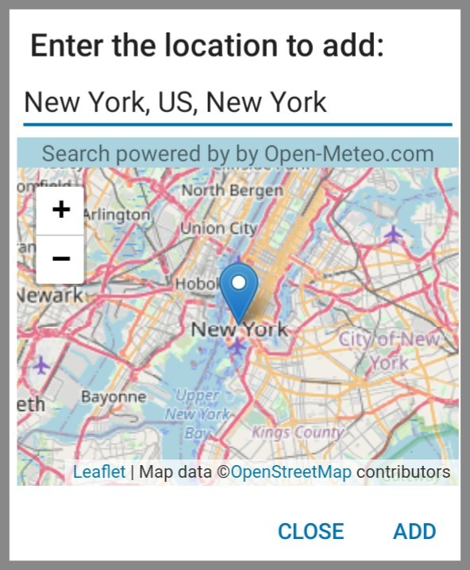

# OmGeoDialog

### Overview

This library contains an Android DialogFragment for search-as-you-type via the Open-Meteo geocoding API.
(see https://open-meteo.com/en/docs/geocoding-api)
You can type an address and get the coordinates back. The result will be shown on a map.

 


### Installation

Add the JitPack repository to your root build.gradle at the end of repositories:

```gradle
allprojects {
  repositories {
    ...
    maven { url 'https://jitpack.io' }
  }
}
```

Add the library dependency to your build.gradle file.

```gradle
dependencies {
    implementation 'com.github.woheller69:OmGeoDialog:V1.0'
}
```

### Usage

Let your activity implement OmGeoDialog.OmGeoDialogResult

```
        public class MainActivity extends AppCompatActivity implements OmGeoDialog.OmGeoDialogResult

```

and override onOmGeoDialogResult, where you define what to do with the result 

```
    @Override
    public void onOmGeoDialogResult(City city) {

    String cityName = city.getCityName();
    String countryCode = city.getCountryCode();
    float lon = city.getLongitude();
    float lat = city.getLatitude();
    
    // do what you need to do
    
    }
```

Open a search dialog:

```
        FragmentManager fragmentManager = getSupportFragmentManager();
        OmGeoDialog omGeoDialog = new OmGeoDialog();
        omGeoDialog.setTitle("Search");
        omGeoDialog.setNegativeButtonText("Cancel");
        omGeoDialog.setPositiveButtonText("Select");
        
        //Optional: Define countries. Otherwise locations in all countries are shown
        ArrayList<String> countryList = new ArrayList<>();
        countryList.add("DE");
        countryList.add("AT");
        omGeoDialog.setCountryList(countryList);
        
        //Optional: Define User-Agent
        omGeoDialog.setUserAgentString(BuildConfig.APPLICATION_ID+"/"+BuildConfig.VERSION_NAME);
        
        omGeoDialog.show(fragmentManager, "");
        getSupportFragmentManager().executePendingTransactions();
        omGeoDialog.getDialog().getWindow().setSoftInputMode(WindowManager.LayoutParams.SOFT_INPUT_STATE_ALWAYS_VISIBLE);

```

### License

This library is licensed under the GPLv3.

The library uses:
- Leaflet which is licensed under the very permissive <a href='https://github.com/Leaflet/Leaflet/blob/master/FAQ.md'>2-clause BSD License</a>
- Map data from OpenStreetMap, licensed under the Open Data Commons Open Database License (ODbL) by the OpenStreetMap Foundation (OSMF) (https://www.openstreetmap.org/copyright)
- Search-as-you-type location search is provided by [Open-Meteo.com](https://open-meteo.com/en/docs/geocoding-api)
- Android Volley (com.android.volley) (https://github.com/google/volley) which is licensed under <a href='https://github.com/google/volley/blob/master/LICENSE'>Apache License Version 2.0</a>
- AndroidX libraries (https://github.com/androidx/androidx) which is licensed under <a href='https://github.com/androidx/androidx/blob/androidx-main/LICENSE.txt'>Apache License Version 2.0</a>
- AutoSuggestTextViewAPICall (https://github.com/Truiton/AutoSuggestTextViewAPICall) which is licensed under <a href='https://github.com/Truiton/AutoSuggestTextViewAPICall/blob/master/LICENSE'>Apache License Version 2.0</a>

